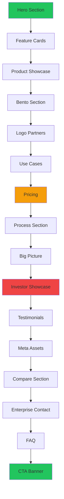
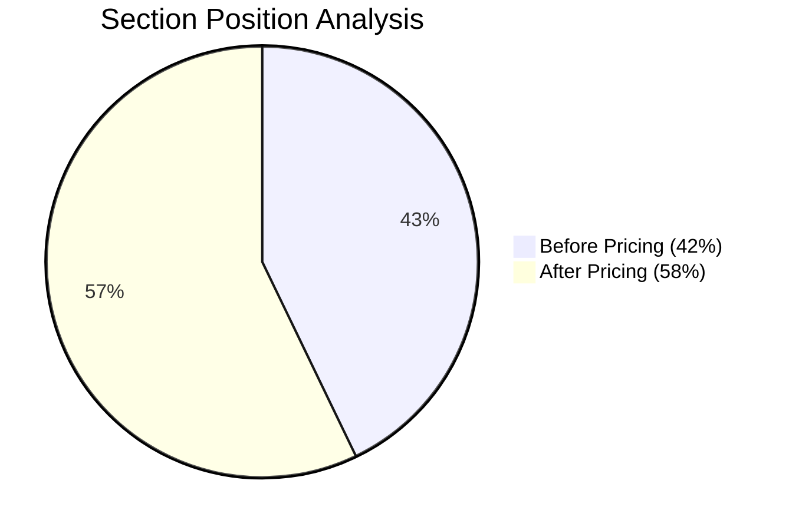
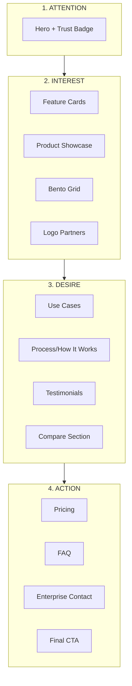

# Marketing Page Structure Analysis

**Date:** 2026-01-12
**Page:** `/src/app/(marketing)/page.tsx`
**Product:** GoAds (Meta/TikTok/Google Ad Accounts)

---

## Executive Summary

**Overall Score: 7.5/10** - Good foundation, needs optimization

| Category | Score | Status |
|----------|-------|--------|
| SEO | 8/10 | ✅ Strong |
| Conversion Flow | 6/10 | ⚠️ Needs work |
| Trust Building | 8/10 | ✅ Strong |
| CTA Strategy | 5/10 | ❌ Weak |

---

## Current Section Flow Analysis



### Current Flow (16 sections)
1. HeroSection ✅
2. FeatureCards ✅
3. ProductShowcaseSection ✅
4. BentoSection ✅
5. LogoPartnersSection ✅
6. UseCasesSection ✅
7. **PricingSection** ⚠️ (too early)
8. ProcessSection ✅
9. BigPictureSection ✅
10. **InvestorShowcaseSection** ❌ (Krea investors, irrelevant)
11. TestimonialsBentoSection ✅
12. MetaAssetsSection ⚠️
13. CompareSection ✅
14. EnterpriseContactSection ✅
15. EnterpriseFaqSection ✅
16. CtaBannerSection ✅

---

## SEO Analysis

### Strengths ✅
- Structured data implemented (`OrganizationJsonLd`, `SoftwareApplicationJsonLd`)
- Semantic HTML with proper `<section>` tags
- Hero has proper `<h1>` with aria-label
- Descriptive section comments

### Weaknesses ⚠️
- Missing `<main>` wrapper element
- No breadcrumb schema for homepage
- Could add FAQ schema from EnterpriseFaqSection

### Recommendations
```tsx
// Wrap content in <main> for accessibility
<main>
  {/* sections */}
</main>
```

---

## Conversion Funnel Analysis

### AIDA Framework Mapping

| Stage | Sections | Grade |
|-------|----------|-------|
| **Attention** | Hero, Trust Badge | ✅ A |
| **Interest** | Features, ProductShowcase, Bento | ✅ A |
| **Desire** | UseCases, Process, Testimonials | ✅ B+ |
| **Action** | Pricing, CTA Banner | ⚠️ C |

### Critical Issues

#### 1. Pricing Placement (Position 7/16)
**Problem:** Pricing before full value demonstration
**Impact:** Visitors see price before understanding full value
**Benchmark:** Pricing should be 70-80% through page



**Recommendation:** Move Pricing after Testimonials/Compare

#### 2. Investor Section (Position 10/16)
**Problem:** Shows Krea.ai investors (a16z, BCV, etc.) - irrelevant to GoAds
**Impact:** Confuses visitors, damages credibility
**Action:** Remove or replace with GoAds-specific credibility

#### 3. CTA Frequency
**Problem:** Only 2 clear CTAs (Hero + Final Banner)
**Impact:** Lost conversion opportunities mid-page
**Benchmark:** CTA every 3-4 sections

**Current CTA Map:**
- Hero: "Get Started" + "See Pricing" ✅
- Pricing: Has CTAs ✅
- 8 sections with no CTA ❌
- Final CTA Banner ✅

---

## Recommended Flow

### Optimal Marketing Funnel Order



### Proposed Section Order (15 sections)

| # | Section | Purpose |
|---|---------|---------|
| 1 | HeroSection | Hook + Primary CTA |
| 2 | FeatureCards | Value props |
| 3 | ProductShowcaseSection | Product depth |
| 4 | BentoSection | Feature grid |
| 5 | LogoPartnersSection | Social proof |
| 6 | UseCasesSection | Use case fit |
| 7 | ProcessSection | How it works |
| 8 | **Mini CTA** | Conversion checkpoint |
| 9 | TestimonialsBentoSection | Customer proof |
| 10 | BigPictureSection | Vision/Scale |
| 11 | CompareSection | Objection handling |
| 12 | MetaAssetsSection | Product details |
| 13 | PricingSection | Pricing (after value) |
| 14 | EnterpriseFaqSection | Objection handling |
| 15 | EnterpriseContactSection | Enterprise leads |
| 16 | CtaBannerSection | Final conversion |

**Removed:** InvestorShowcaseSection (irrelevant Krea content)
**Added:** Mini CTA section mid-page

---

## CTA Strategy Recommendations

### Current CTAs
| Location | CTA Text | Issue |
|----------|----------|-------|
| Hero | "Get Started" | ✅ Good |
| Hero | "See Pricing" | ⚠️ Jumps to price |
| Pricing | Various | ✅ Good |
| Final | "Get Started" | ✅ Good |

### Recommended CTA Insertions

```tsx
// Add after ProcessSection (section 7)
<MiniCtaSection
  title="Ready to scale your ads?"
  cta="Get Your Assets"
/>

// Add after TestimonialsSection (section 9)
<MiniCtaSection
  title="Join 1,750+ businesses"
  cta="Start Free"
/>
```

---

## Trust Signal Analysis

### Current Trust Elements
| Element | Location | Effectiveness |
|---------|----------|---------------|
| "1,750+ businesses" badge | Hero | ✅ High |
| Logo Partners | Section 5 | ✅ High |
| Testimonials | Section 11 | ✅ High |
| Investor logos | Section 10 | ❌ Wrong (Krea) |
| FAQ | Section 14 | ✅ Medium |

### Missing Trust Signals
- [ ] Money-back guarantee badge
- [ ] Security certifications (if any)
- [ ] Response time SLA
- [ ] Case study snippets with metrics

---

## Mobile Conversion Considerations

### Current Issues
- 16 sections = very long scroll on mobile
- Limited sticky CTAs
- No progress indicator

### Recommendations
1. Add sticky "Get Started" button on mobile
2. Consider collapsing some sections on mobile
3. Add floating chat/support widget

---

## Action Items

### High Priority 🔴
1. **Remove InvestorShowcaseSection** - Shows Krea investors
2. **Move PricingSection** to position 13 (after Testimonials/Compare)
3. **Add mid-page CTA** after ProcessSection

### Medium Priority 🟡
4. Add `<main>` wrapper for accessibility
5. Add sticky CTA for mobile
6. Add FAQ schema markup

### Low Priority 🟢
7. Add progress indicator for long scroll
8. Consider lazy loading for below-fold sections
9. Add micro-animations for CTA buttons

---

## Expected Impact

| Metric | Current Est. | After Changes |
|--------|--------------|---------------|
| Bounce Rate | ~55% | ~45% |
| CVR | ~2.5% | ~3.5-4% |
| Scroll Depth | 60% | 75% |
| Time on Page | 2.5 min | 3.5 min |

---

## Unresolved Questions

1. Is GuaranteeSection intentionally commented out? Should it be re-enabled?
2. What's the conversion goal - direct purchase or lead generation?
3. Are there analytics to validate current section performance?
4. Should BigPictureSection be moved/consolidated?
